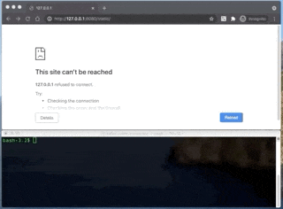

# kafka-video-broadcast
A Go server for enabling video broadcast via Kafka

# What do you get?


# What's happening?
1. Client HTML page loaded from golang web server
1. WebSocket connection established to same golang server
1. Webcam captured and byte stream sent via WebSocket (MediaRecorder)
1. Go server produces video bytes to Kafka topic
1. Go server consumes video bytes from Kafka
1. Go server sends Kafka consumed bytes via WebSocket to client
1. Client inserts video bytes into MediaSource buffer


# Why?
Client side capabilities are always extending - I wanted to see what could be done with webcam capture and re-constituting video bytes from any served source. I was kicked into doing it after reading an article on ycombinator news...

- https://mattbutterfield.com/blog/2021-05-02-adding-video-chat
    - This site uses a golang server to co-ordinate the WebRTC connection between two peers. The video bytes go over WebRTC directly between peers (not via the server. However, the WebRTC setup is done via a Google PubSub connection.
    - This requires a STUN server (or TURN server if clients aren't publicly accessible). Working for Confluent I had simple access to Kafka running in Confluent Cloud so I didn't need to worry about any of the distributed components or scaling.

- https://github.com/webrtc/samples/issues/1256
    - Which linked to the very helpful https://jsfiddle.net/43rm7258/1/
    - This helped me figure out some of the technicalities of re-constucting video from a remote source.

# How do I run it?
In your shell...
```
# Setup Kafka configuration...
$ BOOTSTRAP_SERVERS=your.kafka.bootstrap.dns:9092
$ SASL_MECHANISMS=PLAIN
$ SECURITY_PROTOCOL=SASL_SSL
$ SASL_USERNAME=my-secret-username
$ SASL_PASSWORD=my-secret-password

# Run it!
$ make run
```
Then point your browser at http://127.0.0.1:8080/static/index.html

# Caveats
My day job isn't as a software engineer... the quality of the code in this repo is likely to be questionable. I mostly did it for fun and to see what the lag would be like.